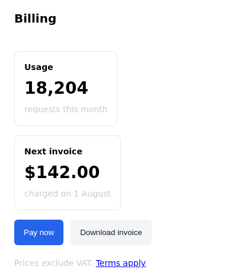
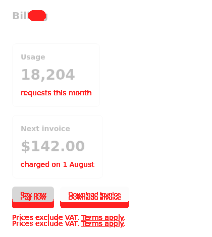
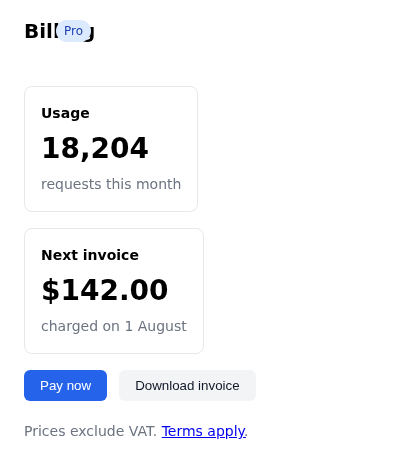

<div align="center">

<picture>
  <source media="(prefers-color-scheme: dark)" srcset="./docs/assets/logo-dark.svg">
  
</picture>

# qain

**Style-regression testing that reports what changed and what merely moved.**

</div>

The logo *is* the tool: a faint frame (the **before**), a solid frame offset over
it (the **after**), and the red square where they overlap — the **diff**.

Pixel VRT tells you two images differ. It cannot tell you why, it cannot tell an
LLM why, and it goes red when a font renders one pixel to the left. qain captures
the browser's *used values* — resolved computed styles, layout boxes, paint order,
composited colors — and diffs them semantically.

Here is a billing page, a commit that breaks it four ways at once, and the
pixel diff:

| before | after | pixel diff |
| --- | --- | --- |
|  |  |  |

The pixel diff is where a screenshot tool stops: *some pixels are red*. qain,
on the same two pages:

```
default state
  html > body > header > span[data-testid=plan-badge]
    z-index: 2 → 0
    paint order: 4 → 3 (stacking changed)
    ← .badge { z-index: 2 → 0 }  theme.regressed.css:21:3
  html > body > main > section[data-testid=usage-card] > p[data-testid=usage-note]
    color: rgb(107, 114, 128) → rgb(199, 203, 212)
    contrast 4.83 → 1.63  ✗ falls below WCAG AA-normal
    ← .muted { color: rgb(107, 114, 128) → rgb(199, 203, 212) }  theme.regressed.css:30:3
  html > body > main > div > button[data-testid=pay]
    resized 0px × +12px
    ← .btn { padding: 8px 16px → 14px 16px }  theme.regressed.css:4:3
  ...

:hover
  html > body > main > div > button[data-testid=pay]
    background-color: rgb(29, 78, 216) → rgb(37, 99, 235)
    contrast 6.7 → 5.17
    ← .btn-primary:hover { background: rgb(29, 78, 216) → rgb(37, 99, 235) }  theme.regressed.css:15:3
  ...

39 changes: 14 primary, 25 derived
```

Four regressions, four named causes — selector, value, `file:line` — and the 25
elements that only moved because a button above them grew are folded away as
consequences. The same commit also rehashes every utility class name; qain
reports nothing for that, because nothing rendered differently.

This exact demo — the interactive replay you can fade between, the HTML report,
the raw snapshots — is live at
**[shinyaigeek.github.io/qain](https://shinyaigeek.github.io/qain/)**,
regenerated by CI from [`examples/`](./examples). And you can drive the whole
capture → diff → replay yourself, on a page you edit, in the
**[in-browser playground](https://shinyaigeek.github.io/qain/playground/)** — no
install, no server: `@qain/core`'s `captureDom` reads the live DOM into the same
snapshot the CLI produces over CDP.

**Chromium only, by design.** `DOMSnapshot.captureSnapshot` and
`CSS.forcePseudoState` have no Firefox or WebKit equivalent, and qain is built on
both.

This README is the design story. For usage — [getting started](./docs/getting-started.md),
the [CLI reference](./docs/cli.md), [recipes](./docs/recipes.md), the
[snapshot format](./docs/snapshot-format.md), and the
[library API](./docs/library.md) — see [`docs/`](./docs/README.md), also
hosted at [shinyaigeek.github.io/qain/docs](https://shinyaigeek.github.io/qain/docs/).

## Try it now

```sh
npx playwright install chromium    # once — qain drives real Chromium over CDP
npx @qain/cli snap https://example.com --rules -o page.json
```

That is a full style snapshot of any URL a browser can open — every rendered
element with its resolved computed styles, layout box, paint order, and the CSS
rules that matched it, as plain JSON. Snap twice, `qain diff` the two files, and
you have the report above.

## Install

```sh
pnpm add -D @qain/cli         # CLI (installs the `qain` binary)
pnpm add -D @qain/playwright  # Playwright matcher
pnpm add -D @qain/vitest      # Vitest browser-mode matcher
pnpm add -D @qain/storybook   # Storybook test-runner matcher
pnpm add -D @qain/core        # library
```

Node 22+ or Bun: any npm-compatible package manager works, and the CLI and
library run on the Bun runtime too (`bunx @qain/cli`, `bun --bun`) — CI exercises
the full snap → diff → replay cycle under Bun.

## CLI — for humans and coding agents

```sh
qain snap http://localhost:3000 --rules --replay -o before.json
# ... change the code ...
qain snap http://localhost:3000 --rules --replay -o after.json
qain diff before.json after.json --omit-derived
qain diff before.json after.json --replay report.html   # and look at it
```

Exit code is 1 when the diff is non-empty, so an agent can gate on it. `--json`
emits the diff as structured data; `--html report.html` writes a standalone page.
For a multimodal model — or a PR comment — `qain shot` renders `before.png`,
`after.png`, and `diff.png` from the snapshots alone, no app required.

## The snapshot is data

Diffing is one thing to do with a snapshot. It is also the fastest way to pull
a page's computed styles and DOM out of a real browser as JSON — per element:
tag, attributes, accessible role and name, layout box, paint order, and every
projected style as the *used value* Chromium resolved, never the `var(--x)` you
wrote:

```sh
qain snap http://localhost:3000 --selector '[data-testid=pay]' \
  | jq '.states[0].nodes[] | {path, tag, styles, box}'
```

```jsonc
{
  "path": "html > body > main > div > button[data-testid=pay]",
  "tag": "button",
  "styles": {
    "color": "rgb(255, 255, 255)",
    "background-color": "rgb(37, 99, 235)",
    "font-family": "Arial",
    "font-size": "13.3333px",
    "border-top-left-radius": "6px",
    // … the full projection, ~60 properties
  },
  "box": [24, 370, 83.125, 31]
}
```

The format is stable and documented — see
[snapshot & diff format](./docs/snapshot-format.md) — so scripts and agents can
consume it without qain on the other end.

## Playwright

```ts
import { expect, test } from '@qain/playwright'

test('home page styles', async ({ page }) => {
  await page.goto('/')
  await expect(page).toMatchStyleSnapshot({ states: ['hover', 'focus-visible'] })
})
```

Baselines live beside the test and honour `--update-snapshots` exactly as
`toHaveScreenshot` does. On failure the matcher attaches an HTML diff to the
Playwright report, so nobody has to install a viewer.

## Vitest browser mode

The natural home for component-level VRT is `@vitest/browser`, where each test
already mounts one component in a real Chromium. `@qain/vitest` snapshots it there —
no Storybook boot, parallel per test, provider and theme fidelity inherited from
your `.storybook/preview` or test setup.

```ts
import { render } from 'vitest-browser-react'
import { test } from 'vitest'
import { expect } from '@qain/vitest'

test('primary button', async () => {
  render(<Button variant="primary">Pay</Button>)
  await expect(document.body).toMatchStyleSnapshot({ states: ['hover', 'focus-visible'] })
})
```

Vitest runs every test inside an iframe, so `@qain/core` grew a `frameUrl` capture
option to target that frame; the matcher points it at `location.href` for you. The
first run writes `__qain__/<test>.qain.json` beside the test and passes, following
Vitest's snapshot convention rather than `toHaveScreenshot`'s. No config: baselines
persist through Vitest's built-in browser file commands. See
[`@qain/vitest`](./packages/vitest/README.md).

## Storybook test runner

Already have stories? Each one becomes a style test. The runner renders every story
in a real Chromium and hands `postVisit` a Playwright page — qain takes a CDP session
from it, exactly as the Playwright integration does.

```ts
// .storybook/test-runner.ts
import { matchStyleSnapshot } from '@qain/storybook'

export default {
  async postVisit(page, context) {
    await matchStyleSnapshot(page, context)
  },
}
```

Baselines land in `qain-snapshots/<story-id>.qain.json`. First run writes and passes;
under `CI` a missing baseline fails, so an uncommitted one can't slip through. See
[`@qain/storybook`](./packages/storybook/README.md).

qain drives Chromium over CDP through whatever your Playwright config launches. The
configs in `e2e/` and `examples/` default to the system **Chrome** channel; if your
CI only ships Playwright's bundled Chromium, set `channel: 'chromium'` in your
config (or, in those example configs, point `QAIN_CHROME_PATH` at a Chrome binary).

## How it compares

**Percy and Chromatic** screenshot your UI, diff the pixels in the cloud, and
put a human review queue in front of the result. **Playwright's
`toHaveScreenshot` and BackstopJS** run the same pixel diff locally against
golden images. In every case the answer is an image with red on it — *where* it
changed. *What* changed and *why* is left to a human squinting at two
screenshots, which is exactly the part that doesn't scale to a coding agent, and
the same pipelines go red on font antialiasing and one-pixel kerning shifts.

qain answers in a different unit: properties. `color` changed from this to that
on these nodes, contrast now fails AA, caused by this declaration at
`theme.css:12` — and the elements that moved four pixels as a consequence are
labelled as consequences. No cloud, no review queue, no golden images: two JSON
files, a text report, and an exit code.

The trade is real: qain sees used values, not pixels. A regression inside a
gradient, an image's content, or antialiasing itself is invisible to it —
`qain shot` exists for eyes, but when pixel-perfect rendering *is* the thing
under test, pixel VRT is the right tool. And qain is Chromium-only, where the
pixel tools are not.

## Why it is quiet

A naive DOM+CSS snapshot test is unusable: Chromium reports ~420 computed
properties per element, and changing one CSS variable turns the whole page red.
qain suppresses noise structurally, not with ignore-lists:

**The projection excludes anything the layout box already says.** `padding`,
`margin`, `width` and `height` all resolve into `bounds`, which qain captures
anyway. Recording both would report every change twice — once as the cause, once
as the effect.

**Elements are keyed, not positioned.** `data-testid`, then `id`, then
accessible role + name, then a sibling ordinal. Inserting a `<div>` at the top of
a list reports one addition, not a rewritten subtree.

**`class` is captured but never compared.** Tailwind and CSS Modules rewrite
class strings on every build while the rendering is identical.

**Every change is `primary` or `derived`.** A node that only moved was pushed by
something else. A container that grew only did so to fit a child. Six
`currentColor` properties following one `color` change are one change, not seven.
`--omit-derived` shows you the causes alone.

## Pseudo-states

qain forces `:hover`, `:focus-visible` and friends through CDP and snapshots the
result — something pixel VRT cannot do without synthesising real pointer input. With
`--rules`, the matched declarations are captured inside that same window, so a hover
regression names the `:hover` rule that caused it.

Forcing every button into `:hover` at once is a page state that never occurs in a
browser. It is safe only if hovering changes nothing outside the hovered elements.
So `strategy: 'auto'` (the default) takes one bulk snapshot, checks whether
anything outside the forced subtrees moved or restyled, and silently falls back to
one snapshot per element when it did. A `:hover` that changes `padding` displaces
its siblings; a `.btn:hover ~ .panel` rule restyles a node that is not hovered.
Both are caught. Neither is guessed at.

## Why it names the rule

`--rules` records the matched CSS declarations alongside the snapshot, so the diff
can point at the line that caused each change:

```
button[data-testid=submit]
  resized 0px × +24px
  ← .btn { padding: 8px 16px → 20px 16px }  buttons.css:3:3
```

`padding` is not in the projection — by design, since the box already reports its
effect. Attribution buys the information back from the author's declaration rather
than its resolved consequence, and only for the nodes that changed.

Two things this required getting right, both of which are easy to get wrong:

**Chromium's `matchedCSSRules` is sorted by specificity, not by the cascade.**
`!important` is not folded into that order, and `style=""` is not in the array at
all. Reading the array backwards and taking the first hit — the obvious
implementation — picks the wrong rule whenever `!important` is involved. qain
resolves importance, origin, and inline explicitly, and the e2e suite asserts the
declaration it picks equals the value Chromium computed.

**Nobody writes `padding-top`.** Declarations are expanded through
`longhandProperties` so a `padding-top` change finds `padding: 8px 16px`, then
collapsed back so one edit reads as one cause rather than four.

**A pseudo-state has its own cascade.** `CSS.getMatchedStylesForNode` does not
return `.btn:hover` for a node that is not hovered — so a hover regression can only
be attributed by asking *while the pseudo-class is held down*. qain captures rules
per state, inside the window where the state is forced:

```
:hover
  button[data-testid=pay]
    background-color: rgb(29, 78, 216) → rgb(37, 99, 235)
    contrast 6.7 → 5.17
    ← .btn-primary:hover { background: rgb(29, 78, 216) → rgb(37, 99, 235) }  theme.css:15:3
```

A single index keyed by node would have pointed at the resting `.btn` rule, which
has nothing to do with the change. Attributions are keyed by `(state, node)`.

When a primary change has no declaration behind it — a longer label widened the
button — qain says `no CSS declaration on this node changed` instead of blaming a
rule that happens to mention `width`. Derived changes are never attributed at all;
their cause is another node.

Cost: one CDP round-trip per node, and roughly 3× the snapshot size. Hence opt-in.
A pseudo-state adds only its forced subtrees — three nodes, not the whole page.

## Replay

`qain view` rebuilds the page from the snapshot. Not a screenshot — a
reconstruction, and it is exact:

```sh
qain snap http://localhost:3000 --replay -o page.json
qain view page.json -o page.html
```

The trick is that **replay never re-runs layout.** Every element is placed at the
rectangle Chromium gave it, and every *line* of text at the rectangle Chromium
gave that line (`--replay` records those; `DOMSnapshot` returns them alongside the
boxes). Nothing cascades, nothing reflows, nothing depends on the viewport, so
nothing can come out subtly different from what was recorded.

This is also how the projection gets away with omitting `padding`. A button's text
run sits eighteen pixels inside its border box; that offset **is** the padding,
already resolved. Margins, flex distribution, text alignment and the line breaks
in a wrapped paragraph all arrive the same way.

The e2e suite asserts that the rebuilt page is **pixel-identical** to the original.

`qain diff a.json b.json --replay out.html` writes both reconstructions into one
page, side by side or stacked with an opacity slider. A four-pixel shift is
invisible in two images next to each other and obvious when you fade one into the
other:



(Try it on the [live demo](https://shinyaigeek.github.io/qain/).) Causes are outlined in red, collateral in grey, and the cause list scrolls
you to whichever one you click. The Playwright matcher attaches this to the run's
report on failure.

Not reproduced: rotations and skews (`bounds` is post-transform but axis-aligned,
so a rotated element replays as its bounding box), and anything outside the
projection — gradients, backdrop filters, clip paths.

## Contrast

Because Chromium reports the *composited* background (`blendedBackgroundColors`),
qain computes WCAG contrast against what the eye actually receives — a half-opaque
white panel over blue reads `rgb(128, 128, 255)`, not `rgba(255,255,255,0.5)`.
A ratio that crosses a WCAG threshold is reported by name.

## What it does not do

- **Replay rotations.** See above: a rotated element comes back as its bounding box.
- **Attribute pseudo-elements.** `::before` rules arrive under the host's
  `pseudoElements`, which qain does not yet read.
- **Attribute across nodes.** A rule that stopped matching because a class changed
  shows up as a declaration appearing or disappearing, not as "you removed
  `.primary`".
- **Map CSS-in-JS back to source.** emotion and chakra inject a runtime `<style>`,
  so `--rules` attributes a change to that injected sheet — the `file:line` is real,
  but it points at the generated CSS, not the `.tsx` recipe that emitted it.
- **Cross-browser.** See above.

## Layout

| package | what |
| --- | --- |
| `@qain/core` | capture, projection, diff, reports. No Playwright dependency. |
| `qain` | the CLI. |
| `@qain/playwright` | fixture, `toMatchStyleSnapshot`, report attachment. |
| `@qain/vitest` | `toMatchStyleSnapshot` for Vitest browser mode — component VRT with no Storybook boot. |
| `@qain/storybook` | `matchStyleSnapshot` for the Storybook test runner — every story becomes a style test. |

`@qain/core` asks only for `{ send(method, params) }`, so it works with
Playwright, Puppeteer, or a raw CDP socket.

## Examples

`examples/` is a billing page plus a commit that breaks it four ways at once — a
reflow, a contrast regression, a stacking-order change, a `:hover` state that
stopped differing — alongside a utility-class rehash that must produce no diff at
all. It runs, and it asserts what it demonstrates.

```sh
pnpm demo    # the CLI workflow, end to end against the real binary
```

## Development

```sh
pnpm install
pnpm browsers      # tests use Chrome, the CLI launches chromium
pnpm build
pnpm test          # e2e + examples
pnpm check         # biome
```

Runtime: Node 22 or newer (`engines`). Development pins Node 26 via `.nvmrc`.

## License

[MIT](./LICENSE) © Shinyaigeek
